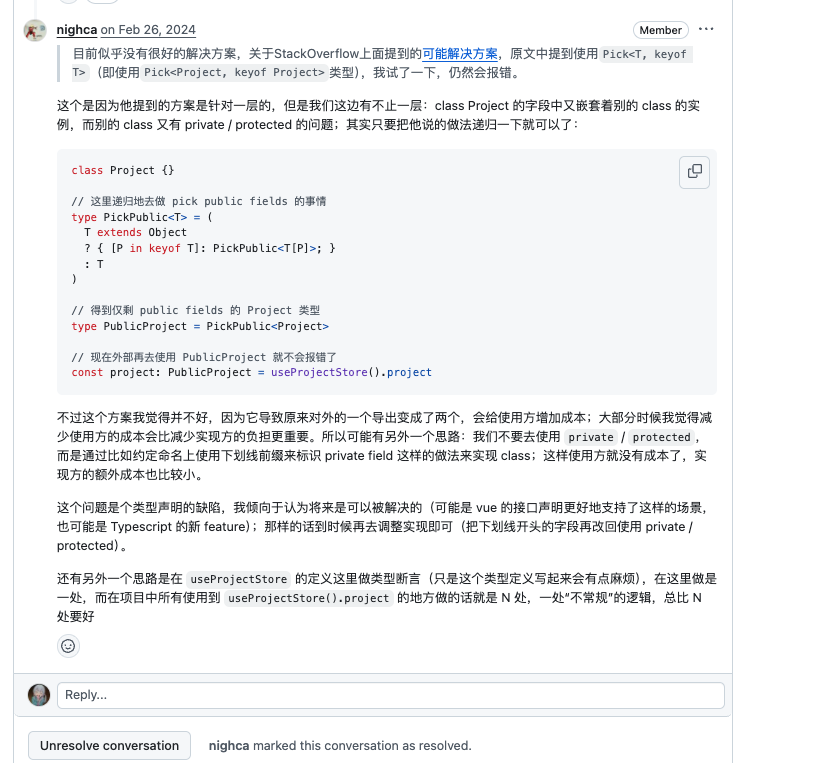

# 同学，为什么我建议你关注 1024 实训营？

2023 年底，我幸运地通过 1024 创作节获得了参加第一届 1024 实训营的机会,这次经历彻底改变了我对技术学习和职业发展的认知。

与其他公司的实习不同，七牛云的实训营不是简单地让我们熟悉业务或写代码，而是提供了一个完整的项目实战机会。在实训营中，我们完整经历了技术选型、需求分析、架构梳理、模块拆分、实际编码测试，最终到上线和路演的整个软件开发生命周期。这种全方位的实战体验，让我第一次深刻理解了 1024 实训营"实践驱动成长"的培养理念。

实训过程中最令我印象深刻的是导师们对工程质量的极致追求。一个 PR 经常被来回 review 三四十条 comment，比如 <https://github.com/goplus/builder/pull/122> 和 <https://github.com/goplus/builder/pull/96>。从前端构建过程到代码实现、从工程规范到部署落地，导师们以几乎"苛刻"的态度对待每一个技术细节。这种严谨的工程文化深深影响了我，至今在我的工作中，我仍然保持着对 PR 质量的高标准要求。

在接口设计阶段，导师们也不会简单地告诉我们“应该怎么做”，而是引导我们思考：这个接口的核心需求是什么？未来可能如何演变？当前设计是否存在潜在问题？这种启发式的教学方式培养了我的系统思维能力和前瞻性设计意识，受益匪浅。

回到 XGo 这个项目本身，XGo 是实训营的核心内容，更是一个硬核的、涉及编程语言底层技术的开源项目，它为不同技术、不同水平的同学提供了丰富的学习机会：

- 前端开发者可以从 XBuilder 项目入手
- 对 AI 感兴趣的可以探索 AI 辅助编码功能
- 底层技术爱好者可以深入研究 XGo 编译器及 LLGo 编译器等

每一层技术挑战都有实力强悍的导师耐心指导。这种阶梯式的学习路径让每个人都能找到适合自己的成长方向。

目前我正在负责 XGo 的底层编译器 LLGo 的子项目——llcppg，旨在自动生成 C/C++ 库的 LLGo Binding。通过这个项目，我不仅更深入理解了 C 编译器工作原理，也更理解了不同语言在设计其语法特性时的思考，还经常能从这一角的开源实践，窥探到整个软件工程的历史。在开发过程中也经常会得到导师们的经验上的分享、以及在架构设计方面的持续指导，这段经历成为我技术成长的重要里程碑。对于该工程的相关技术细节我专门写了一篇文章分享（<https://mp.weixin.qq.com/s/cx9F5lYKyxwvFpokicJ8Yw>），项目代码也已开源在 GitHub（<https://github.com/goplus/llcppg>），欢迎沟通交流。

可以说，实训营的经历直接影响了我现在的工作方式：

- 对代码质量保持高标准
- 敢于在架构、技术方面进行交流碰撞
- 乐于分享

另外，对于学生参与开源，我认为这是一件“浪漫而实用”的事情。正如 Linus Torvalds 所说：“Talk is cheap. Show me the code.” 你的 GitHub 主页就是最好的能力证明，无论是求职还是技术交流，实实在在的代码贡献胜过千言万语。

所以，如果可能，我建议你也应该参加 1024 实训营。在这里, 你将获得：

- 实战成长：完整的项目经历胜过碎片化学习
- 导师文化：与顶尖工程师深度交流的机会
- 开源视野：参与真实开源项目的宝贵经验
- 职业跳板：为未来求职积累硬核项目经验

如果你渴望真正的技术成长，1024 实训营将可能是你学习生涯中最值得把握的机会之一。在这里，你不仅能学到技术，更能培养工程师的思维方式和工作习惯——这些将让你在未来的职业道路上走得更远。

期待在下一届实训营见到你，让我们一起用代码创造价值！