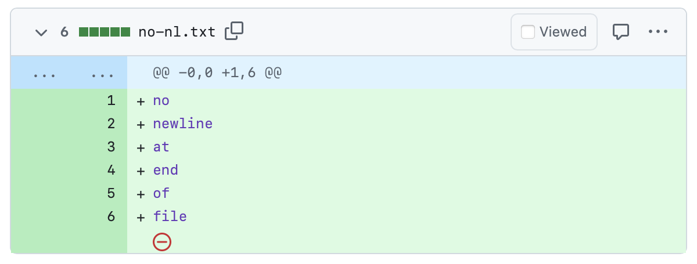

# 一行之差：为什么你的文件末尾应该留一个空行？

> 
>
> “咦？怎么 GitHub PR 里多了个 ⛔️ 小红标？”
>
> —— 每个第一次看到 *No newline at end of file* 提示的程序员

## 1. 规范视角：什么才算“一行”？

[POSIX 标准](https://pubs.opengroup.org/onlinepubs/9699919799/basedefs/V1_chap03.html#tag_03_206)将一行定义为“零个或多个非 `<newline>` 字符，加上一个终止 `<newline>` 字符”。缺少换行符的最后一行在标准意义上并不完整，只是“半行”。遵守这一约定可确保所有 POSIX 工具按照同一种方式读取、统计和处理文本行。

## 2. Unix 传统：留给终端一点呼吸

早期 Unix 工具都是“按行工作”。如果文件结尾没有换行符，下一条 shell 提示符会紧贴在最后一行文字后面，既难看又易误操作。多敲一次 `Enter`，终端输出自然分行，交互更顺畅。

### 小实验

```bash
$ printf 'foo\n' > a.txt      # 末尾有换行
$ printf 'bar'   > b.txt      # 末尾无换行
$ cat a.txt b.txt
foo
bar$                          # 提示符粘在 bar 后面
```

## 3. 协作实践：比你想的影响更大

| 场景 | 少了末尾换行会怎样 |
| :-- | :-- |
| **Git diff / PR review** | Git 会提示 `No newline at end of file`；GitHub 会显示 ⛔️ 警告图标，分散注意力 |
| **Git blame** | 之后有人补上换行符时会“占据”最后一行，掩盖真正修改者，污染历史 |
| **Merge 冲突标记错位** | 冲突标记 `<<<<<<<` 紧贴正文，影响编辑器识别与手动合并 |
| **crontab** | 文件最后一行无换行时，Cron 会拒绝安装该任务 |
| **行数统计** | `wc -l` 只数换行符，可能少算 1 行，脚本逻辑因此出错 |
| **追加日志** | `>>` 追加时上一文件末尾与新内容黏在一起，日志解析出错 |
| **NDJSON/JSONL** | 缺换行导致最后一条记录无法被完整解析或直接被忽略 |

这些“小坑”往往在生产部署或 CI/CD 流水线中才暴露，代价远高于敲一个回车。

## 4. 编辑器生态：VS Code 为何默认不开？

| 编辑器 | 默认行为 | 背后考量 |
| :-- | :-- | :-- |
| **Vim/Neovim** | `fixendofline` 启用，保存时自动补换行 | 传承 Unix 文化，优先规范 |
| **VS Code** | `"files.insertFinalNewline": false` | 避免“擅自改文件”，兼顾旧项目与 Windows 历史 |

VS Code 并非反对该实践，而是更谨慎：由团队或个人自行决定。大多数团队会在 `.editorconfig` 或项目设置中统一开启它。

如果你正在使用 VS Code，不妨现在就打开设置，搜索 `insertFinalNewline`，将它改为 `true`。动起手来，从此告别那一行小红叉。

除了编辑器，不少编程语言自带的代码格式化工具也会主动补上末尾换行。例如 Go 的 `gofmt`、Rust 的 `rustfmt`、C 的 `clang-format` 等，都默认在保存时插入换行。这类行为体现了 Unix 系文化对一致性和简洁的追求，也延续了“新泽西学派”的工程哲学：工具自动维护格式，开发者专注于逻辑与结构，而非纠结细节。它们所鼓励的，是一种让格式“自动对齐”、人脑“专注编码”的开发方式。

## 5. 落地建议：让空行成为默认

1. **团队规范先行**

   ```ini
   # .editorconfig
   [*]
   insert_final_newline = true
   ```

2. **本地编辑器跟上**

   - VS Code：`settings.json` 加 `"files.insertFinalNewline": true`
   - JetBrains IDEs：`Preferences > Editor > General > On Save > Ensure line feed at file end`

这样，无论谁提交代码，都不会再出现奇怪的 ⛔️ 提示。

## 6. 一句话总结

> 末尾那一个看不见的回车，是让终端、工具链和团队都安心的小小保险。

花一秒按下 `Enter`，省下无数次 debug 的夜晚。让留空行成为你的默认工程习惯吧。
