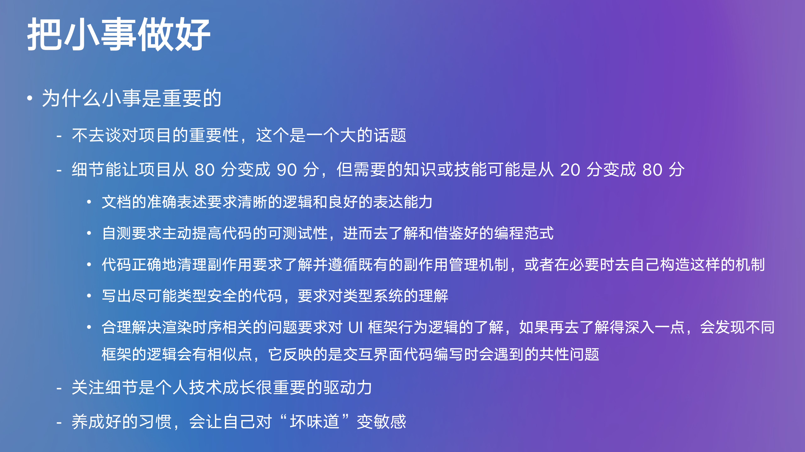

# 工程实践分享 | 把小事做好

在有着多年 Web 开发经验的资深技术人杨寒星看来，在工程实践过程中做好一些“小事”是很重要的。在日前举办的第三期 1024 实训营结营成果展示会上，杨寒星基于同学们的“实现 Go+ Builder 向导系统”这一项目成果展示，分享了他的一些启发，也娓娓讲述了为什么把小事做好，对开发者的个人成长有着比想象更深刻长远的积极意义与影响。
* 杨寒星 GitHub：https://github.com/nighca

## 一些启发

要在3个月内实现 Go+ Builder 向导系统，这是比较复杂、工作量比较大的一件事——同学们要涵盖从调研、到设计、再到实现的整个流程的工作；而且，Go+ Builder 本身是已经做了一段时间的项目，要在既有成果的基础上再开展设计、添加能力、编写代码等，势必也要面对一定的复杂度；此外，同学们还要在实现过程中处理很多具体问题（比如，代码检测如何实现等）。

这整个过程，对我也有一些启发。拿代码检测这件事来说，我们在设计这个功能的时候，考虑过逐字符的匹配，也考虑过正则，或者通过 Compiler 去对代码做 parse，然后对 AST 进行检查，从而检查用户是否正确地输入了一段代码。想了这么多方式之后，我们后来才想到用大模型来解决这个问题，这其实是一个非常典型的、非常好的关于“在大模型的能力变得更加成熟之后，它能够去改变我们既有的交互范式，进而改变我们解决已有问题的方式”的例子。

## 把小事做好

这次实训过程，因为时间紧、任务重，我们在过程中对很多“似乎暂时不影响功能实现”的细节关注得并不多，但今天我想借这个机会再来分享一下，我是如何看待这些“小的事情”的。

小事是指哪些事情呢？它可能包括：是否在设计/产品/技术文档中进行了精准的表述、文档的格式细节是否正确、每个模块在集成之前是否做了充分的自测、代码中的实例在生命周期结束时其副作用是否被正确清理、类型安全问题、在做复杂客户端应用时经常面临的时序问题等等。

无论是文档方面，还是代码方面，这些“小事”暂时不处理似乎也没什么问题，反正项目可以继续、功能也能实现、用户也能使用，但其实，把小事做好，无论是对项目，还是对个人，都是很有意义的。今天，我们主要谈谈，“把小事做好”对个人的积极意义。

做好了刚才提到的那些小事，也许只能把一个项目从 80 分变成 90 分，或是从 60 分变成 80 分，但这个过程所需要的个人知识技能则可能是从 20 分变成了 80 分。根据二八原则，当你掌握 20% 的技能，你就能够搞定 80% 的事情，但如果你想额外搞定 10-20% 的事情，这可能就会需要你再增加 80% 的知识技能。

比如，如果你要在文档中进行准确表述，这就会对你的逻辑梳理是否清晰、表达能力是否良好有很高要求；如果你总是在集成模块前做充分自测，那你就会主动提高自己代码的可测试性，进而去了解/借鉴好的编程范式，当你提高了代码的可测试性之后，也许你就可以尝试通过编写自动化的测试用例来做测试，即使不能完全自动化，你去手动构造测试用例的过程也会变得更简单；为了做好代码副作用的管理，你得去了解并遵循系统/框架中既有的副作用的管理机制，或在必要时自己构建这样的机制；如果你总是想尽可能可靠地、体验更好地解决时序问题，那么你就不得不去了解 UI 框架的渲染行为的细节，再更深入一些的话，你甚至会发现不同框架的渲染行为的细节是有共同相似点的，其实它们反映的是交互界面的代码编写过程会遇到的一些共性问题，你只有深入细节才有可能去看到这些背后的共性的问题。所以，关注细节是个人技术成长很重要的一个驱动力。

关注细节、尝试把这些看上去好像不重要的事情做好，也有助于让你对“坏味道”敏感——文档写得不准确、设计不完善导致有风险、代码隐藏了潜在问题等等。这就好像一个有洁癖的人，他总是能第一时间感知到周围环境的不干净。当你养成了对“坏味道”的敏感，它对你个人后续的产出效率、产出质量，也是有好处的。

## 附：Go+ Builder 向导系统项目简介
Go+ Builder 为创作者而生! 它不仅仅是一个游戏编辑器，更是一个旨在帮助用户提升计算思维和系统设计能力的教育工具。通过 Go+ builder，用户可以直观地理解和构建复杂系统，培养解决问题的能力。

基于 Go+ Builder 的发展现状，本期实训同学们将实现 Go+ Builder 的向导系统，降低用户的使用门槛与学习成本，可能的手段包括但不限于：UI 引导、交互式教程、使用文档、帮助机器人等。
* Go+ Builder Github Repo: https://github.com/goplus/builder
* Go+ Builder 线上环境: https://builder.goplus.org

更多实训项目详情与干货分享，欢迎点击「阅读原文」，

或在B站搜索「七牛云」官方账号，

观看「1024实训营（第三期）」视频合集。
